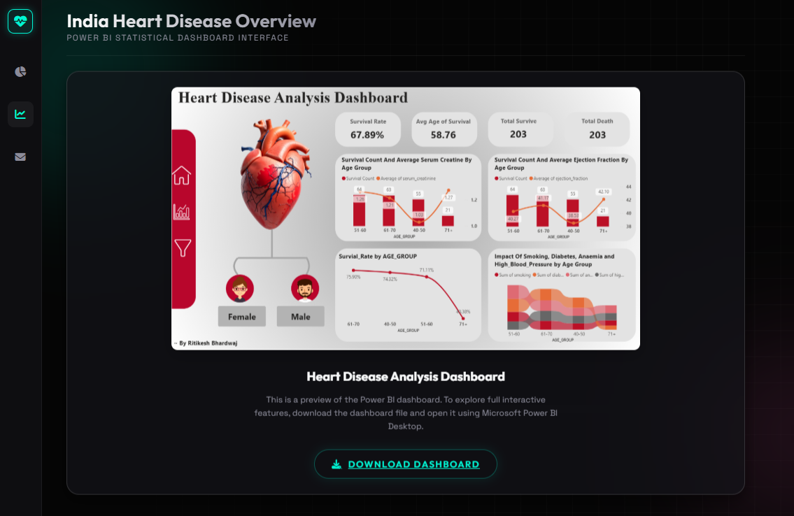
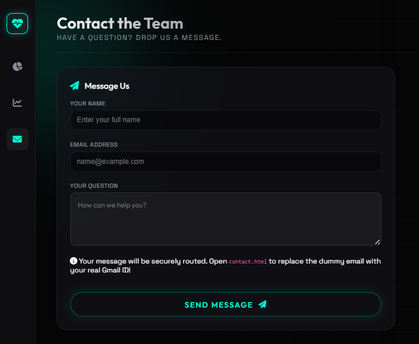
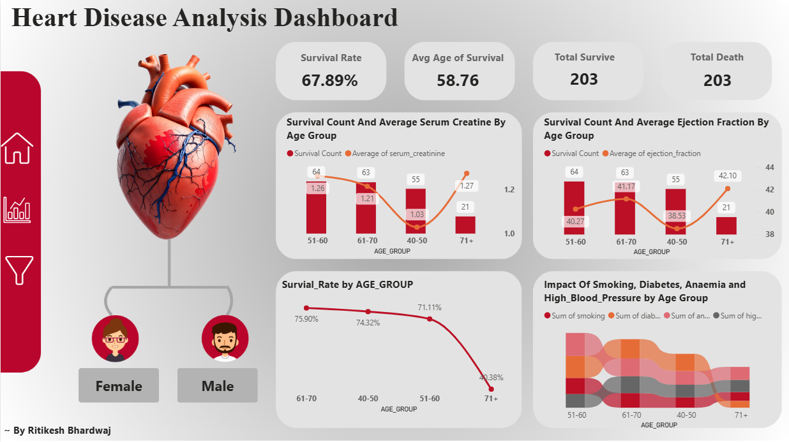

<div align="center">

# Cardio ML - Neural Cardiology Assessment

</div>

---

## About the Project

ML MODEL IN GOOGLE COLAB (PDF): [ML MODEL IN GOOGLE COLAB](Documents/Heart%20Disease%20Prediction.ipynb%20-%20Colab.pdf)

Cardio ML Intelligence is a machine learning project that helps predict heart disease risk in patients.It combines a trained model with a clean and responsive user interface, making it easy to use for both students and healthcare professionals.The application uses a Flask-based backend to process user input and run predictions. Even if some patient data is missing, the system handles it automatically using smart data filling techniques. Instead of just giving a yes/no result, it also shows a probability score, helping users understand how likely a patient is to have heart disease.


<table align="center">
  <tr>
    <td align="center"></td>
    <td align="center"></td>
  </tr>
  <tr>
    <td align="center"></td>
    <td align="center"></td>
  </tr>
</table>

---

<div align="center">
  
## Dashboard

<br>

<br>
  
</div>

---

## Key Features

-  Machine Learning Engine: Predicts heart disease using a trained model with good accuracy.
-  Fast Web Interface: Works smoothly without page reload using JavaScript.
-  Smart Data Handling: Missing inputs are automatically filled, so the system never breaks.
-  Power BI Dashboard: Shows patient data insights with interactive charts.
-  Responsive Design: Works well on mobile, tablet, and desktop.
-  Contact Form: Users can send messages easily through an integrated form.


---

## Tech Stack

### Frontend
- HTML5: Page structure
- CSS3: Styling, layout, and animations
- JavaScript: Handles form and updates UI

### Backend
- Python: Core logic
- Flask: API handling
- NumPy & Pandas: Data processing

### Machine Learning
- Scikit-learn: Prediction and probability
- Joblib: Loads trained mode

---

## Setup & Installation (How to Run)

The application can be easily run on any local environment.

**1. Clone the repository:**
```bash
git clone https://github.com/your-username/Cardio-ML-Assessment.git
cd Cardio-ML-Assessment
```

**2. Install dependencies:**
Make sure you have Python 3.8+ installed. You can install all required packages using pip:
```bash
pip install -r requirements.txt
```

**3. Run the Flask application:**
Start the backend server engine by executing the main script:
```bash
python app.py
```

**4. Access the web application:**
Once the terminal displays that the server is running, open your web browser and navigate to:
```text
http://127.0.0.1:5000/
```

*(Note: The server will automatically serve the initial `index.html` file.)*

---

## 👨‍💻 Author

**Ritikesh Bhardwaj** 
* GitHub: [RitikesH-28](https://github.com/RitikesH-28)
* LinkedIn: [Ritikesh Bhardwaj](www.linkedin.com/in/ritikesh-bhardwaj-274a48254)

*If you like this project, please consider giving it a ⭐!*
